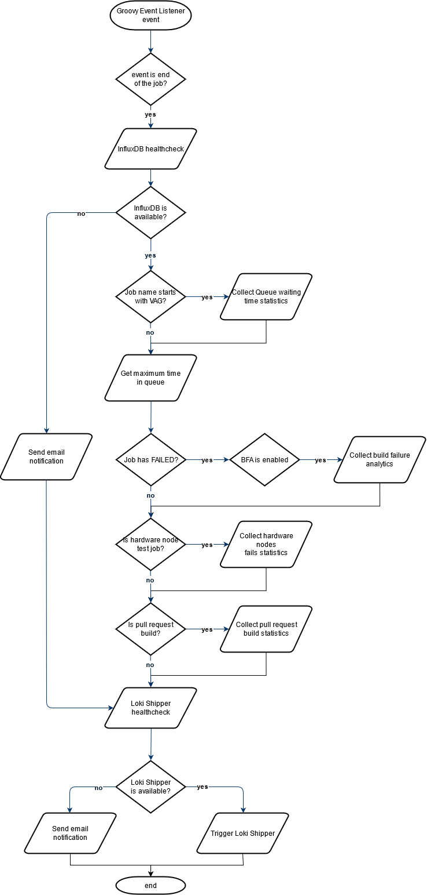

# Groovy Event Listener

This is the script which should be used for [Groovy Event Listener plugin](https://plugins.jenkins.io/groovy-events-listener-plugin/) in Jenkins configuration.

## Performed functions
There multiple events those can trigger the script, but in the current configuration functions will be launched only on event **RunListener.onFinalized**.

The following functions can be performed depending on run details:
* getQueueTimeByTask
* triggerLokiShipper
* getMaxTimeInQueue
* getBFAData
* getHWNodesFails
* getPullRequestBuildStatistics

Additionally, there are some utility functions:
* sendEmailNotification
* getPipelineName

Classes for interaction with InfluxDB:
* InfluxDBWriter
* InfluxDBPoint

## Workflow diagram

## Health checks
Before triggering Loki Shipper and on creating instance of InfluxDBWriter there are health checks, which are curl requests to the respective API. If health check is failed, the script will not try sending requests to this resource.
